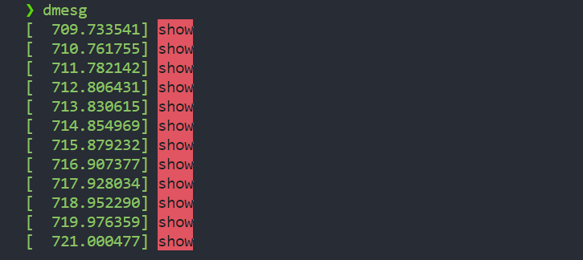
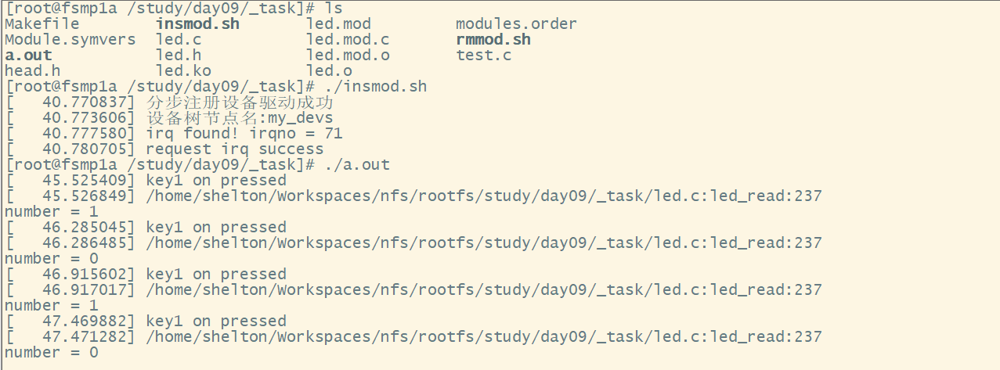
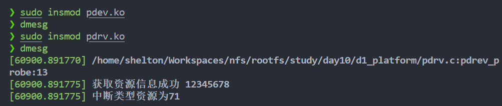

## 01.[GPIO-点亮led1-led2-led3](https://github.com/zhuang-xd/demo-code/tree/master/linux%E9%A9%B1%E5%8A%A8/01.GPIO-%E7%82%B9%E4%BA%AEled1-led2-led3)


## 02.[通过ioctl函数选择不同硬件的控制LED、蜂鸣器、马达、风扇](https://github.com/zhuang-xd/demo-code/tree/master/linux%E9%A9%B1%E5%8A%A8/02.%E9%80%9A%E8%BF%87ioctl%E5%87%BD%E6%95%B0%E9%80%89%E6%8B%A9%E4%B8%8D%E5%90%8C%E7%A1%AC%E4%BB%B6%E7%9A%84%E6%8E%A7%E5%88%B6LED%E3%80%81%E8%9C%82%E9%B8%A3%E5%99%A8%E3%80%81%E9%A9%AC%E8%BE%BE%E3%80%81%E9%A3%8E%E6%89%87)

`main.c` 是应用层的程序编译成 `a.out` 来测试驱动

```shell
arm-linux-gnueabihf-gcc main.c
```

生成 `.ko` 驱动文件

```shell
make ARCH=arm MODNAME=led
make ARCH=arm MODNAME=fan
make ARCH=arm MODNAME=motor
make ARCH=arm MODNAME=beep
```

安装驱动

```shell
./insmod.sh
```

卸载驱动

```shell
./rmmod.sh
```

## 03.[分步注册驱动](https://github.com/zhuang-xd/demo-code/tree/master/linux%E9%A9%B1%E5%8A%A8/03.%20%E5%88%86%E6%AD%A5%E6%B3%A8%E5%86%8C%EF%BC%8C%E6%AF%8F%E4%B8%AA%E8%AE%BE%E5%A4%87%E6%96%87%E4%BB%B6%E6%8E%A7%E5%88%B6%E4%B8%80%E4%B8%AALED)

> 创建三个设备文件，每个设备文件和一个LED灯绑定，当操作这个设备文件时只能控制设备文件对应的这盏灯。

```c
/**
 * 相关API
 * #include <linux/cdev.h>
 * #include <linux/fs.h>
 * #include <linux/devices.h>
 * 1. 分配字符设备驱动对象空间
 *      struct cdev *cdev_alloc(void);
 * 2. 字符设备驱动对象部分初始化
 *      void cdev_init(struct cdev *, const struct file_operations *);
 * 3. 申请设备号
 *      静态 extern int register_chrdev_region(dev_t, unsigned, const char *);
 *      动态 extern int alloc_chrdev_region(dev_t *, unsigned, unsigned, const char *);
 * 4. 注册字符设备驱动对象
 *      int cdev_add(struct cdev *, dev_t, unsigned);
 * 5. 向上提交设备目录
 *      class_create(owner, name)
 * 6. 向上提交设备节点
 *      device_create(struct class *cls, struct device *parent, dev_t devt, void *drvdata, const char *fmt, ...);
*/
```


## 04. gpio子系统

现象：安装完驱动后，led1亮起

提示：

1. 通过 `make dtb` 编译 `linux-stm32mp-5.10.61-stm32mp-r2-r0/linux-5.10.61/arch/arm/boot/dts`目录下的 `stm32mp157a-fsmp1a.dts`文件
2. 设备树文件 `stm32mp15xx-fsmp1x.dtsi`
3. 旧版api 驱动源文件 `my_led.c`
4. 新版api 驱动源文件 `new_my_led.c`

## 05. 定时器

现象：

## 06.信号驱动IO

1. 实现基于gpio子系统完成LED灯驱动的注册，应用程序测试
2. 在内核模块中启用定时器，定时1s,让led1 一秒亮、一面灭
3. 通过信号驱动IO实现，两个IO操作的复用

## 07.中断子系统

实验：

- 通过设备树访问key1、key2、key3，按下按键时执行中断的回调函数

现象：


## 08.tasklet

任务队列示例

## 09.work

工作队列示例

## 10.中断综合练习

实验

- 修改设备树节点，通过GPIO子系统控制 led1 和 key1
- 应用程序通过阻塞IO读取 内核中 led 驱动的 number 变量
- 按下 key1 后 led1 亮灭状态切换，number值在0、1切换

现象



## 11.platform总线驱动

实验：

- 使用 `int pdrev_probe(struct platform_device *pdev)` 代替（匹配到`struct of_device_id of_table[] `中的设备树就会被调用 ）
  - `static int __init led_init(void)`

- 使用 `int pdrev_remove(struct platform_device *pdev)` 代替
  - `static void __exit led_exit(void)`

- 使用宏 `module_platform_driver(pdrev_driver);` 代替
  - `module_init(led_init);`
  - `module_exit(led_exit);`

现象


